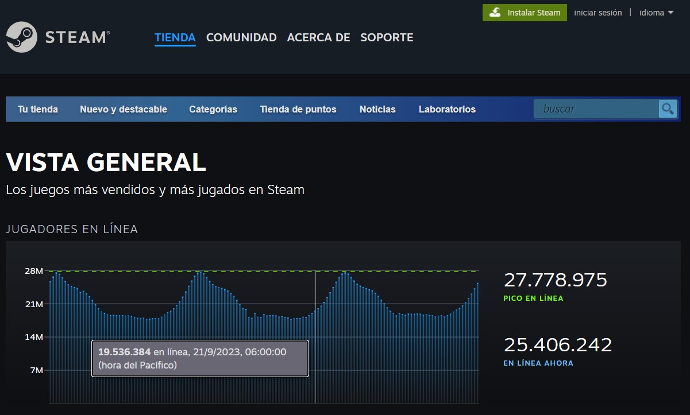

# <h1 align=center>**Proyecto Integrador Data Science**</h1>

 

# <h1 align=center> **`MACHINE LEARNING OPERATIONS (MLOps)`** </h1>

# INTRODUCCIÓN
El ciclo de vida de un proyecto de Machine Learning debe contemplar desde el tratamiento y recolección de los datos (Data Engineer stuff) hasta el entrenamiento y mantenimiento del modelo de ML según llegan nuevos datos.

En este caso práctico nos situamos en el rol de **Data Scientist** dentro de *STEAM* una reconocida plataforma multinacional de videjuegos, donde se nos plantea un problema de negocio para el cual debemos crear un sistema de recomendación de videojuegos para usuarios utilizando ML y una API para que se pueda consultar en la web.

Actualmente sus datos carecen de madurez: Datos anidados, de tipo raw, no hay procesos automatizados para la actualización de nuevos productos, entre otras cosas.
Debemos comenzar desde cero con el trabajo de **Data Engineer** 

**Objetivo: alcanzar un MVP para el cierre del proyecto**

*A continuación se muestra el mapa conceptual del proyecto:*

# CONTEXTO
Steam es una plataforma de distribución digital de videojuegos desarrollada por Valve Corporation. Fue lanzada en septiembre de 2003 como una forma para Valve de proveer actualizaciones automáticas a sus juegos, pero finalmente se amplió para incluir juegos de terceros.
Se utiliza tanto por pequeños desarrolladores independientes como grandes corporaciones de software para la distribución de videojuegos y material multimedia relacionado.

Para poder disfrutar de todos estos servicios, es necesario estar registrado en el servicio mediante la creación de una cuenta gratuita, a la que se vinculan los videojuegos comprados por el jugador. 

En 2007 se creó SteamCommunity para el registro del tiempo de uso además de vender juegos de Valve en digital.
En enero de 2016, Steam contaba con más de 7300 juegos disponibles. Además contaba con cerca de 142 millones de cuentas de usuario activas.

La siguiente imagen es una captura de pantalla de la web de estadísticas de Steam donde muestra en tiempo real la cantidad de usarios activos en los úlitmos 2 días.

# DATOS
Para el desarrollo del proyecto contamos con 3 datasets:

- user_reviews.json.gz: contiene los comentarios que los usuarios realizaron sobre los juegos que consumen proporcionando el ID y la url del usuario, sobre las reseñas muestra una serie de información adicional como fecha de publicación, si recomienda o no el juego, entre otras.

- users_items.json.gz: es un dataset que contiene información sobre los juegos que juegan los usuarios. Posee información detallada acerca de la interacción usuario-juego, como las horas jugadas. Además proporciona la cantidad de juegos que adquirió el usuario.

- steam_games.json.gz: es un dataset que contiene información detallada de todos los juegos en sí, como los título, el desarrollador, los precios, características técnicas, etiquetas, entre otros datos.

En el documento [Diccionario de datos]([Diccionario de Datos STEAM.xlsx](https://github.com/Theramon88/proyecto_ML/blob/c838914811ee937a1004f54e23a2546b1d0e884e/Diccionario%20de%20Datos%20STEAM.xlsx)) se encuetran los detalles de cada una de las variables de los conjuntos de datos.

# DESARROLLO GENERAL

## ETL 

Comenzamos con el proceso de ETL (extract, transform and load), siendo este el primer paso hacia la generación de conocimiento a partir de datos. En esta etapa se busca conocer la información con la que contamos, las diferentes estrucuras y formatos que mantienen los datos, así como las relaciones entre los datasets, con el objetivo de lograr la integración de los mismos para su posterior utilización de forma eficiente y efectiva.
Se realizó la extracción, transformación y carga de los tres conjuntos de datos entregados los cuales se encontraban comprimidos en .gz.
Dos de los archivos presentaban errores de sintaxis lo cual dificultó un tanto este proceso ya que se debieron utilizar algunas técnicas y librerías adicionales para poder leer correctamente los archivos.
Por otra parte algunos datos se encontraban anidados, es decir había columnas con diccionarios o listas de diccionarios, por lo que aplicaron distintas estrategias para transformar las claves de esos diccionarios en columnas. Luego se rellenaron algunos nulos de variables necesarias para el proyecto, se borraron columnas con muchos nulos o que no aportaban al proyecto, para optimizar el rendimiento de la API y teneniendo en cuenta las limitaciones de almacenamiento del deploy. Para las transformaciones se utilizó la librería Pandas.

## DESARROLLO DE FUNCIONES Y API

Para el desarrolo de la API se decidió utilizar el framework FastAPI, creando las siguientes funciones:

* **userdata**: Esta función tiene por parámentro 'user_id' y devulve la cantidad de dinero gastado por el usuario, el porcentaje de recomendaciones que realizó sobre la cantidad de reviews que se analizan y la cantidad de items que consume el mismo.

* **countreviews**: En esta función se ingresan dos fechas entre las que se quiere hacer una consulta y devuelve la cantidad de usuarios que realizaron reviews entre dichas fechas y el porcentaje de las recomendaciones positivas (True) que los mismos hicieron.

* **genre**: Esta función recibe como parámetro un género de videojuego y devuelve el puesto en el que se encuentra dicho género sobre un ranking de los mismos analizando la cantidad de horas jugadas para cada uno.

* **userforgenre**: Esta función recibe como parámetro el género de un videojuego y devuelve el top 5 de los usuarios con más horas de juego en el género ingresado, indicando el id del usuario y el url de su perfil.

* **developer**: Esta función recibe como parámetro 'developer', que es la empresa desarrolladora del juego, y devuelve la cantidad de items que desarrolla dicha empresa y el porcentaje de contenido Free por año por sobre el total que desarrolla.

* **sentiment_analysis**: Esta función recibe como parámetro el año de lanzamiento de un juego y según ese año devuelve una lista con la cantidad de registros de reseñas de usuarios que se encuentren categorizados con un análisis de sentimiento, como Negativo, Neutral y Positivo.

    >  * ## Feature engineering

        Uno de los pedidos para este proyecto fue aplicar un análisis de sentimiento a los reviews de los usuarios.
        Para ello se creó una nueva columna llamada 'sentimento' en la cual se clasifica los sentimientos de los comentarios
        con la siguiente escala:

            > 0 si es malo,
            > 1 si es neutral o esta sin review
            > 2 si es positivo.

       El análisis de sentimiento se realizó utilizando NLTK (Natural Language Toolkit) una librería open source de Python para
       procesamiento de lenguaje natural.El objetivo de esta metodología es asignar un valor numérico a un texto, en este caso a
       los comentarios que los usuarios dejaron para un juego determinado, para representar si el sentimiento expresado en el texto
       es negativo, neutral o positivo.  

* **recomendacion_juego**: Esta función recibe como parámetro el nombre de un juego y devuelve una lista con 5 juegos recomendados similares al ingresado.

* **recomendacion_usuario**: Esta función recibe como parámetro el id de un usuario y devuelve una lista con 5 juegos recomendados para dicho usuario teniendo en cuenta las similitudes entre los usuarios.

Los detalles del desarrollo general se puede ver en [Desarrollo](Desarrollo.ipynb)

# EDA - Sistema de RECOMENDACIÓN 

## ANÁLISIS EXPLORATORIO DE DATOS (EDA)

Si bien la etapa de ETL va acompañada de un primer análisis exploratorio de los datos, previo al modelado de las variables a utilizar en el sistema de recomendación se realizó un EDA enfocado en este resultado.
Con el objetivo de investigar las relaciones entre variables del dataset, ver si hay outliers o anomalías o si hay algún patrón interesante que valga la pena explorar en un análisis posterior.

Se tomó la decisión de resolver el modelo mediante un enfoque items-items, el cual busca realizar recomendaciones en base a similitudes entre los juegos, utilizando la técnica "similitud coseno". A partir de esta decisión, esta etapa se centró sólo en los datos escogidos para el desarrollo del modelo, los cuales estaban contenidos en en dataset 'steam_games'.
Para esto se utilizó la librería Pandas para la manipulación de los datos y las librerías Matplotlib y Seaborn para la visualización.

Como resultado de este proceso se construyó un dataframe con el ID de usuario, los nombres de los juegos y el campo "tags" utilizados para hallar las similitud coseno entre los juegos. 

## SISTEMA DE RECOMENCACIÓN (MACHINE LEARNING)

El desafío en esta instancia era desarrollar un sistema de recomendación utilizando técnicas de aprendizaje supervisado que pueda ser accesible a través de la API, para el mismo se debía desarrollar la siguiente función:
    
*   **def recomendacion_juego(id de producto):** *Ingresando el id de producto, deberíamos recibir una lista con 5 juegos recomendados  similares al ingresado.*

El modelo tiene una relación ítem-ítem, esto es, se toma un juego y en base a que tan similar es ese juego con el resto de los juegos se recomiendan similares.

Para medir la similitud entre los juegos (item_similarity) se utilizó la **similitud del coseno** que es una medida comúnmente utilizada para evaluar la similitud entre dos vectores en un espacio multidimensional. En el contexto de sistemas de recomendación y análisis de datos, la similitud del coseno se utiliza para determinar cuán similares son dos conjuntos de datos o elementos, y se calcula utilizando el coseno del ángulo entre los vectores que representan esos datos o elementos.
En este caso esta técnica se aplicó utilizando las "tags" de los juegos, las cuales son características específicas de cada juego. El modelo encuentra similitudes basandose en estos atributos.

El desarrollo del EDA y la creación del modelo se presenta en la Jupyter Notebook [EDA_ML](EDA_ML.ipynb)).

# DEPLOYMENT

Para el deploy de la API se seleccionó la plataforma Render que es una nube unificada para crear y ejecutar aplicaciones y sitios web, permitiendo el despliegue automático desde GitHub. Para esto se siguieron estos pasos:

- Generación de un Dockerfile cuya imagen es Python 3.11. Esto se hace porque Render usa por defecto Python 3.7, lo que no es compatible con las versiones de las librerías trabajadas en este proyecto, por tal motivo, se optó por deployar el proyecto dentro de este contenedor. Se puede ver el detalle del documento [Dockerfile](dockerfile).

- Se generó un servicio nuevo  en `render.com`, conectado al presente repositorio y utilizando Docker como Runtime.
- Finalmente, el servicio queda corriendo en [https://fastapi-t91i.onrender.com/](https://fastapi-t91i.onrender.com/).

# VIDEO

En este [video]() se explica brevemente este proyecto mostrando el funcionamiento de la API.
